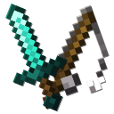

# Legacy Combat for 1.21.11
An [Ignite](https://github.com/vectrix-space/ignite) mod that ports the entirety of Minecraft 1.8.9's combat mechanics to the latest version. It uses a combination of new components/attributes while also porting the old mechanics' code when necessary.

## Features
- ⭐ Highly configurable with the in-game command: `/lcconfig`
- ⭐ Projectiles:
    - Ported old projectile bounding box logic
    - Fishing rod, snowballs and eggs deal knockback
    - Old fishing hook velocity
    - Removed relative velocity
    - Accurate bow boosts
- ⭐ Applied item components:
    - Consumable component on swords (sword blocking)
    - Hitbox margin component on every item (same as pre-1.9)
    - Removed cooldown for ender pearls
- Old armor damage reduction
- Removed 1.9+ attack particles
- Removed attack cooldown
- Removed 1.9+ attack sounds
- Ported 1.8 knockback
- Crits while sprinting
- Old regeneration & exhaustion
- Disabled sword sweep
- Sword blocking with accurate damage reduction
- Old hurt cam animation
- Entity data fix
  - Fixes double sneaking animation
  - Fixes double use/consume animation

## Usage
You need to be running a server with Ignite. [Here](https://github.com/vectrix-space/ignite?tab=readme-ov-file#install) are the instructions to use it - then, all you need to do is put this mod in the `mods` folder.
  Currently tested with:
- PaperMC ✅
- LeafMC ✅
- PurpurMC ✅ (not recommended, use Leaf instead)
- AdvancedSlimePaper ✅